# 📊 Proyecto Final – Indicador de Participación de Créditos del BCP

## 🏦 Banco de Crédito del Perú (BCP)

El Banco de Crédito del Perú (BCP) es el banco más grande y antiguo del sistema financiero peruano, con más de 130 años de operación y liderazgo en colocaciones y depósitos a nivel nacional. Forma parte del holding financiero Credicorp y atiende a millones de clientes en personas, pymes y empresas, combinando una amplia red física con canales digitales como banca por internet, banca móvil y billeteras digitales como Yape.  

Este proyecto se centra en un **indicador estratégico** que mide la participación del BCP en el mercado de créditos en moneda nacional.

---

## 🧷 Planteamiento del Business Case

Al **31 de mayo de 2025**, el **indicador mensual de participación del BCP en el monto total de créditos otorgados en soles por el sistema bancario peruano** se encuentra en **33.4 %**, clasificado como **semáforo amarillo**.  

La meta del business case es que, para el **31 de mayo de 2026**, este indicador se eleve a **36.0 %** (**semáforo verde**), reforzando el **liderazgo del BCP en el mercado de colocaciones en moneda nacional**.

---

### 🎯 Objetivo del Business Case

Incrementar la participación del BCP en el monto total de créditos otorgados en soles por el sistema bancario peruano:

- **Situación actual (may-2025):** 33.4 %  
- **Meta (may-2026):** 36.0 %  
- **Propósito estratégico:**  
  - Fortalecer el posicionamiento del BCP como banco líder en créditos en moneda nacional.  
  - Sostener el crecimiento rentable de la cartera, con foco en segmentos de alto potencial.

---

### 🧩 Estrategia Propuesta

Para alcanzar el objetivo, se plantea una **campaña nacional de colocaciones preferenciales** orientada a:

- **Mypes** y **créditos de consumo** en regiones con menor bancarización.
- Ofertas con **condiciones competitivas** (tasas, plazos y productos).
- **Alianzas con fintechs y canales digitales** para ampliar alcance y capilaridad.
- **Campañas de educación financiera, publicidad y ferias de crédito** en zonas estratégicas.
- **Bonos por desempeño** para asesores comerciales de regiones objetivo.
- **Recompra de créditos** de clientes actuales para mejorar condiciones y fidelización.

En conjunto, la estrategia busca **aumentar colocaciones**, **profundizar la relación con clientes** y **expandir la presencia del BCP** en regiones con oportunidad de crecimiento.

---

### 💰 Costo–Beneficio Esperado

- **Inversión única estimada:**  
  - Aproximadamente **S/ 50 millones**, principalmente en campañas publicitarias y refuerzo del equipo comercial en campo.
- **Beneficio esperado (escenario de éxito):**  
  - **Facturación adicional mensual estimada:** ~**S/ 9.34 millones** por intereses y comisiones.  
  - **Impacto en el primer año:** alrededor de **S/ 112 millones adicionales** si se sostiene el nuevo nivel del indicador.  

Más allá del impacto financiero directo, la estrategia también fortalece la **fidelización de clientes**, la **posición competitiva del BCP** y la **confianza del mercado** en la gestión del banco.

---

## 📊 Indicador Clave (KPI) del Proyecto

### 🏷️ Nombre del Indicador

**Indicador mensual de participación del BCP en el monto total de créditos otorgados en soles por el sistema bancario peruano.**

---

### 🧾 Definición

Este indicador mide el **porcentaje de participación del BCP** en el total de créditos otorgados en moneda nacional (soles) por todas las entidades bancarias supervisadas en el país.  

Incluye créditos de:

- Consumo  
- Hipotecarios  
- Empresas (mipymes y grandes empresas)

---

### 📐 Fórmula

**Participación BCP (%) = (Créditos del BCP en soles) / (Créditos totales del sistema bancario en soles)**
\]

El resultado se expresa en **porcentaje (%)**.

- **Moneda:** Porcentaje (%)  
- **Frecuencia:** Mensual  

---

### 📉 Impacto Económico de 1 punto porcentual (pp)

En el contexto del business case, una variación de **1 pp** en la participación del BCP en el mercado de créditos en soles representa del orden de **millones de soles en colocaciones mensuales adicionales o perdidas**.  

Por ello, moverse de **33.4 %** a **36.0 %** no solo es un cambio de color en el semáforo, sino una diferencia relevante en **ingresos por intereses y comisiones** y en la **cuota de mercado** del banco.

---

### 🚦 Rangos de Desempeño (Semáforo)

- 🟢 **Verde:**  
  - Participación **≥ 36 %**  
  - Nivel óptimo de liderazgo y crecimiento del portafolio.
- 🟡 **Amarillo:**  
  - Participación entre **30 % y < 36 %**  
  - Zona de alerta: liderazgo aún vigente, pero con espacio de mejora y riesgo de pérdida de mercado.
- 🔴 **Rojo:**  
  - Participación **< 30 %**  
  - Zona crítica: deterioro significativo del posicionamiento competitivo.

---

## 🎯 Objetivos del Proyecto de Analítica y Visualización

El proyecto de Data Visualization tiene como propósito **traducir este business case en una solución analítica completa**, que permita a la gerencia monitorear, explicar y accionar sobre el KPI.

### Objetivo General

Diseñar y desplegar una solución de **analítica y visualización de datos** que permita **seguir mensualmente el indicador de participación de créditos del BCP**, evaluar el impacto de la campaña y soportar la toma de decisiones comerciales y estratégicas.

### Objetivos Específicos

- **Integrar fuentes de datos internas y externas:**  
  Consolidar información de colocaciones del BCP y del sistema financiero (por producto, segmento, región, etc.).

- **Automatizar el cálculo del KPI:**  
  Implementar procesos ETL y modelos de datos que calculen el indicador en forma **consistente, trazable y reproducible**.

- **Diseñar un modelo de datos de negocio:**  
  Construir un modelo semántico que permita analizar el KPI por **segmento, región, canal, producto, tipo de campaña, etc.**

- **Desarrollar dashboards con enfoque de storytelling:**  
  Crear reportes que respondan de forma clara al esquema **“What? – So What? – Now What?”**, mostrando:
  - Situación actual del indicador  
  - Brechas frente a la meta  
  - Impacto económico  
  - Acciones recomendadas

- **Habilitar análisis de drill-through y detalle:**  
  Permitir que usuarios de negocio naveguen desde vistas ejecutivas hasta el detalle de clientes, productos o regiones.

---

## ✨ Resultados Esperados para el Negocio

Con la solución analítica implementada, se espera:

- **Monitoreo estratégico continuo** del KPI, con visibilidad mensual de avances hacia la meta del **36 %**.  
- **Identificación temprana de desviaciones** por región, segmento o producto, permitiendo ajustar campañas en tiempo real.  
- **Medición clara del retorno de la inversión (ROI)** de la campaña de colocaciones preferenciales.  
- **Alineamiento entre áreas comerciales, riesgos y planeamiento**, al trabajar con una **misma versión de la verdad**.  
- Mayor **capacidad de explicar resultados a la alta dirección**, con reportes claros, trazables y visualmente consistentes.

---
# ☁️ Solución de Negocio Cloud con Microsoft Fabric, Power BI y Azure
## ✨ Arquitectura de Datos Moderna para el BCP

Este proyecto implementa una solución de analítica moderna en la nube, diseñada para integrar múltiples fuentes de datos, automatizar procesos ETL y habilitar dashboards ejecutivos que permitan monitorear y accionar sobre el indicador de participación de créditos del BCP.

La arquitectura combina herramientas robustas, escalables y de clase empresarial, asegurando integridad del dato, gobernanza y capacidad de análisis en tiempo real.

🧩 Componentes Principales de la Solución

a) Microsoft Fabric Warehouse & Data Factory:
Plataforma unificada para orquestar, transformar y consolidar datos empresariales, integrando procesos ETL eficientes.

b) Azure SQL (Staging Layer):
Base de datos estructurada en la nube utilizada como zona de staging para alojar datos transaccionales, fuentes SBS y registros históricos.

c) Power BI (Visualización & Modelo Semántico):
Motor analítico donde se construye el modelo de negocio, se crean medidas DAX y se diseñan dashboards ejecutivos con storytelling.

d) Excel / Procesos Operativos:
Canal de entrada y revisión operativa que permite realizar cargas menores, validaciones o lectura rápida de datasets específicos.

e) Usuarios Finales / Dirección / Gestión Comercial
Reciben la visualización final del KPI, con capacidad de drill-down, comparativos, tendencias e interpretación bajo el marco
What? – So What? – Now What?


## 🧱 Arquitectura de Datos

En la siguiente sección se describe la **arquitectura de datos** propuesta para soportar el business case, incluyendo las capas de datos, ETL, almacenamiento y presentación.


# 💾 CAPA DE DATOS

## 1. Creación de tablas (DDL)

Esta capa contiene la definición del modelo relacional implementado para soportar el cálculo del indicador de participación del BCP. Incluye las tablas transaccionales, tablas dimensionales y tablas de referencia provenientes de fuentes internas (BCP) y externas (SBS).

A continuación se muestran ejemplos de código SQL utilizado para crear las tablas principales del modelo.

### 1.1. Tabla de hechos: DVG3_Desembolsos

```sql
CREATE TABLE dbo.DVG3_Desembolsos (
    DesembolsoID        INT           IDENTITY(1,1) PRIMARY KEY,
    SolicitudID         INT           NOT NULL,
    Fecha               DATE          NOT NULL,
    MontoDesembolsado   DECIMAL(18,2) NOT NULL,
    Tasa                DECIMAL(5,2)  NULL,
    PlazoMeses          INT           NULL,
    NroCuotas           INT           NULL,
    EntidadReceptoraID  INT           NULL
);

CREATE TABLE dbo.DVG3_Solicitudes (
    SolicitudID     INT           IDENTITY(1,1) PRIMARY KEY,
    ClienteID       INT           NOT NULL,
    ProductoID      INT           NOT NULL,
    CanalID         INT           NOT NULL,
    EjecutivoID     INT           NOT NULL,
    SegmentoID      INT           NOT NULL,
    MonedaID        INT           NOT NULL,
    EstadoID        INT           NOT NULL,
    FechaEnvio      DATE          NOT NULL,
    MontoSolicitado DECIMAL(18,2) NOT NULL,
    DocCompleto     BIT           NOT NULL
);

CREATE TABLE dbo.DVG3_Cliente (
    ClienteID     INT          PRIMARY KEY,
    TipoCliente   VARCHAR(50)  NOT NULL,
    RangoEdad     VARCHAR(50)  NULL,
    RangoIngreso  VARCHAR(50)  NULL,
    Ocupacion     VARCHAR(100) NULL,
    AniosBanco    INT          NULL
);

CREATE TABLE dbo.DVG3_Region (
    RegionID      INT          PRIMARY KEY,
    NombreRegion  VARCHAR(100) NOT NULL,
    ZonaComercial VARCHAR(100) NULL
);

CREATE TABLE dbo.TargetTabla (
    AnioMes          CHAR(6)       PRIMARY KEY,      -- formato AAAAMM
    Desembolsos_S   DECIMAL(18,2) NOT NULL,
    MarketShare     DECIMAL(5,2)  NULL,
    Target_S        DECIMAL(18,2) NULL
);

CREATE TABLE dbo.DVG3_Desembolsos (
    DesembolsoID        INT           IDENTITY(1,1) PRIMARY KEY,
    SolicitudID         INT           NOT NULL,
    Fecha               DATE          NOT NULL,
    MontoDesembolsado   DECIMAL(18,2) NOT NULL,
    Tasa                DECIMAL(5,2)  NULL,
    PlazoMeses          INT           NULL,
    NroCuotas           INT           NULL,
    EntidadReceptoraID  INT           NULL
);

CREATE TABLE dbo.DVG3_Solicitudes (
    SolicitudID     INT           IDENTITY(1,1) PRIMARY KEY,
    ClienteID       INT           NOT NULL,
    ProductoID      INT           NOT NULL,
    CanalID         INT           NOT NULL,
    EjecutivoID     INT           NOT NULL,
    SegmentoID      INT           NOT NULL,
    MonedaID        INT           NOT NULL,
    EstadoID        INT           NOT NULL,
    FechaEnvio      DATE          NOT NULL,
    MontoSolicitado DECIMAL(18,2) NOT NULL,
    DocCompleto     BIT           NOT NULL
);

CREATE TABLE dbo.DVG3_Cliente (
    ClienteID     INT          PRIMARY KEY,
    TipoCliente   VARCHAR(50)  NOT NULL,
    RangoEdad     VARCHAR(50)  NULL,
    RangoIngreso  VARCHAR(50)  NULL,
    Ocupacion     VARCHAR(100) NULL,
    AniosBanco    INT          NULL
);

CREATE TABLE dbo.DVG3_Region (
    RegionID      INT          PRIMARY KEY,
    NombreRegion  VARCHAR(100) NOT NULL,
    ZonaComercial VARCHAR(100) NULL
);


CREATE TABLE dbo.DVG3_Campania (
    CampaniaID        INT           PRIMARY KEY,
    CampaniaNombre    VARCHAR(200)  NOT NULL,
    FechaInicio       DATE          NULL,
    FechaFin          DATE          NULL
);


CREATE TABLE dbo.DVG3_EntidadReceptora (
    EntidadID    INT           PRIMARY KEY,
    Nombre       VARCHAR(200)  NOT NULL
);

CREATE TABLE dbo.DVG3_Ejecutivo (
    EjecutivoID       INT           PRIMARY KEY,
    NombreEjecutivo   VARCHAR(200)  NOT NULL,
    EquipoComercial   VARCHAR(100)  NULL,
    SucursalID        INT           NULL
);

CREATE TABLE dbo.DVG3_Sucursal (
    SucursalID        INT           PRIMARY KEY,
    NombreSucursal    VARCHAR(200)  NOT NULL,
    RegionID          INT           NOT NULL
);

CREATE TABLE dbo.DVG3_Canal (
    CanalID       INT           PRIMARY KEY,
    CanalNombre   VARCHAR(200)  NOT NULL,
    TipoCanal     VARCHAR(50)   NULL
);

CREATE TABLE dbo.DVG3_Segmento (
    SegmentoID      INT          PRIMARY KEY,
    NombreSegmento  VARCHAR(200) NOT NULL
);

CREATE TABLE dbo.DVG3_Producto (
    ProductoID     INT           PRIMARY KEY,
    Nombre         VARCHAR(200)  NOT NULL,
    Modalidad      VARCHAR(100)  NULL,
    Tipo           VARCHAR(100)  NULL
);

CREATE TABLE dbo.DVG3_Moneda (
    MonedaID        INT           PRIMARY KEY,
    CodigoMoneda    VARCHAR(10)   NOT NULL,
    TipoMoneda      VARCHAR(50)   NULL
);

CREATE TABLE dbo.DVG3_SolicitudEstado (
    EstadoID           INT           PRIMARY KEY,
    DescripcionEstado  VARCHAR(200)  NOT NULL
);

CREATE TABLE dbo.DVG3_MercadoMensual (
    MercadoMensualID         INT           PRIMARY KEY,
    Fecha                    DATE          NOT NULL,
    CantidadPrestamos        INT           NULL,
    MontoTotalDesembolsado   DECIMAL(18,2) NULL
);

CREATE TABLE dbo.TargetTabla (
    AnioMes          CHAR(6)       PRIMARY KEY,      
    Desembolsos_S    DECIMAL(18,2) NOT NULL,
    MarketShare      DECIMAL(5,2)  NULL,
    Target_S         DECIMAL(18,2) NULL
);

```
### 2. DEFINICIÓN DE RELACIONES (FOREIGN KEYS)

```sql
ALTER TABLE dbo.DVG3_Desembolsos
ADD CONSTRAINT FK_Desemb_Solicitudes
FOREIGN KEY (SolicitudID)
REFERENCES dbo.DVG3_Solicitudes (SolicitudID);

ALTER TABLE dbo.DVG3_Solicitudes
ADD CONSTRAINT FK_Sol_Cliente
FOREIGN KEY (ClienteID)
REFERENCES dbo.DVG3_Cliente (ClienteID);

ALTER TABLE dbo.DVG3_Solicitudes
ADD CONSTRAINT FK_Sol_Producto
FOREIGN KEY (ProductoID)
REFERENCES dbo.DVG3_Producto (ProductoID);

ALTER TABLE dbo.DVG3_Solicitudes
ADD CONSTRAINT FK_Sol_Canal
FOREIGN KEY (CanalID)
REFERENCES dbo.DVG3_Canal (CanalID);

ALTER TABLE dbo.DVG3_Solicitudes
ADD CONSTRAINT FK_Sol_Ejecutivo
FOREIGN KEY (EjecutivoID)
REFERENCES dbo.DVG3_Ejecutivo (EjecutivoID);

ALTER TABLE dbo.DVG3_Sucursal
ADD CONSTRAINT FK_Sucursal_Region
FOREIGN KEY (RegionID)
REFERENCES dbo.DVG3_Region (RegionID);
```
### 📌 3. INSERCIÓN DE DATOS (DML)
### 🟦 3.1. Dimensiones

```sql
INSERT INTO dbo.DVG3_Cliente (ClienteID, TipoCliente, RangoEdad, RangoIngreso, Ocupacion, AniosBanco)
VALUES
 (1001, 'Persona Natural', '25-34', 'S/ 3,001 - S/ 5,000', 'Empleado', 3),
 (1002, 'Persona Natural', '35-44', 'S/ 5,001 - S/ 8,000', 'Independiente', 7);

INSERT INTO dbo.DVG3_Region (RegionID, NombreRegion, ZonaComercial)
VALUES
 (1, 'Lima', 'Zona Central'),
 (2, 'Arequipa', 'Zona Sur'),
 (3, 'Piura', 'Zona Norte');

```

### 🟦 3.2. Solicitudes

```sql
INSERT INTO dbo.DVG3_Solicitudes
 (ClienteID, ProductoID, CanalID, EjecutivoID, SegmentoID, MonedaID, EstadoID, FechaEnvio, MontoSolicitado, DocCompleto)
VALUES
 (1001, 10, 1, 501, 1, 1, 1, '2025-05-31', 15000.00, 1),
 (1002, 20, 2, 502, 2, 1, 2, '2025-05-31', 80000.00, 0);
```

### 🟦 3.3. Desembolsos

```sql
INSERT INTO dbo.DVG3_Desembolsos
 (SolicitudID, Fecha, MontoDesembolsado, Tasa, PlazoMeses, NroCuotas, EntidadReceptoraID)
VALUES
 (1, '2025-06-05', 15000.00, 18.50, 36, 36, 1);

```

# 🚀 CAPA ETL (Extracción, Transformación y Carga)

La Capa ETL, implementada con Microsoft Fabric, se encarga de asegurar la calidad, periodicidad y coherencia del flujo de datos del proyecto. Aquí es donde se preparan y procesan los datos antes de ser almacenados y usados por el modelo semántico y el dashboard final.

## A. Orquestación del Flujo de Datos: Dataflows y Pipelines

Para automatizar todo el ciclo mensual de procesamiento, se utilizan Fabric Dataflows Gen2 y Pipelines, que permiten ejecutar tareas de extracción, transformación y carga de forma ordenada y sin intervención manual.

A continuación se describen las tres etapas clave:

## 🔹 1. Extracción (E)

Los Pipelines conectan directamente con la Capa de Datos SQL (DVG2), donde se encuentran las tablas transaccionales y de mercado.
En esta fase se extraen:

- Las transacciones mensuales de ventas y desembolsos.

- Los datos de comportamiento del mercado (por ejemplo, tb_mercado_mensual).

- Atributos maestros necesarios para el cálculo del indicador.

- El objetivo de la extracción es traer la información más reciente y garantizar que el análisis se base en el período correcto.

## 🔹 2. Transformación (T)

Una vez extraídos, los datos pasan a un proceso de transformación donde:

- Se limpian y validan los registros.

- Se ajustan los formatos y tipos de datos.

- Se combinan las distintas fuentes (ventas, mercado, atributos maestros).

- Se prepara la estructura base para el cálculo del KPI de participación.

- En esta fase se invoca un componente adicional (Notebook Python, descrito en la sección siguiente) para ejecutar reglas de negocio avanzadas.

## 🔹 3. Carga (L)

Finalmente, los datos transformados se envían al Fabric Data Warehouse, donde:

- Se almacenan como tablas de análisis optimizadas.

- Se actualiza el dataset utilizado por el modelo semántico.

- Se habilita el consumo directo para Power BI y Excel.

Esta etapa garantiza que los datos queden listos para el modelado y presentación, cumpliendo con los criterios de periodicidad mensual del proyecto.


### 🐍 B. Automatizaciones en Python (Notebooks)

Como parte del proceso ETL, se implementó un Notebook de Python en Microsoft Fabric encargado de automatizar el cálculo mensual del KPI central del proyecto:
el porcentaje de participación del BCP en el total de créditos desembolsados en soles por el sistema financiero peruano.

Esta automatización permite que, cada mes, el sistema procese los datos de forma autónoma, asegurando consistencia, periodicidad y reducción de esfuerzos manuales.

⚙️ Objetivo de la Automatización

El propósito del Notebook es:


🎯 Extraer la información mensual de desembolsos del BCP desde la tabla DVG3_Desembolsos.

🎯 Extraer el volumen total del mercado de créditos desde DVG3_MercadoMensual.

🎯 Consolidar ambos conjuntos de datos.

🎯 Calcular el indicador (Market Share).

🎯 Cargar los resultados procesados en la tabla de resultados TargetTabla.

Este indicador es el que se visualiza posteriormente en Power BI para monitorear el avance hacia la meta establecida para el Business Case.

🔄 Flujo Lógico de la Automatización

El proceso automatizado sigue la siguiente secuencia:

1️⃣ Extracción de Datos

El Notebook se conecta al Lakehouse/SQL para leer:

Los desembolsos mensuales del BCP desde DVG3_Desembolsos.

El total de créditos desembolsados en el sistema financiero peruano desde DVG3_MercadoMensual.

Ambas tablas contienen una columna de fecha, lo que permite agrupar la información por período mensual.

2️⃣ Transformación y Cálculo del KPI

El Notebook:

Construye la clave temporal AnioMes en formato AAAAMM.

Agrupa los desembolsos del BCP por mes.

Agrupa los desembolsos totales del mercado por mes.

Calcula el KPI de participación:

**Participación de mercado (%) = (Créditos del BCP en soles) / (Créditos totales del sistema bancario en soles)**

Este cálculo queda encapsulado dentro de un proceso automatizado, eliminando la necesidad de cálculos manuales o intervención del analista.


3️⃣ Carga del Resultado en la Tabla TargetTabla

Una vez obtenido el KPI:

Se genera un DataFrame final con las columnas:

AnioMes

Desembolsos_S (BCP)

MarketShare (%)

Target_S (opcional, meta del indicador)

Este resultado se sobreescribe o actualiza en la tabla TargetTabla.

Esta tabla es consumida directamente en Power BI para generar visualizaciones del indicador.

⏱️ 4️⃣ Orquestación Automática en Fabric

El Notebook es ejecutado de forma programada mediante un Pipeline de Microsoft Fabric, configurado para correr mensualmente.
De esta manera, el cálculo del KPI, la actualización del dataset, la disponibilidad en Power BI, se generan de forma automática, sin dependencia del usuario.


Con lo anteriormente explicado, se presenta el código usado.

```python

from pyspark.sql import functions as F

# 1. Lectura de tablas desde el Lakehouse / SQL
desemb = spark.read.table("dbo.DVG3_Desembolsos")
mercado = spark.read.table("dbo.DVG3_MercadoMensual")

# 2. Construir clave AnioMes (AAAAMM)
desemb = (
    desemb
    .withColumn("AnioMes", F.date_format(F.col("Fecha"), "yyyyMM"))
    .groupBy("AnioMes")
    .agg(F.sum("MontoDesembolsado").alias("Desembolsos_S"))
)

mercado = (
    mercado
    .withColumn("AnioMes", F.date_format(F.col("Fecha"), "yyyyMM"))
    .groupBy("AnioMes")
    .agg(F.sum("MontoTotalDesembolsado").alias("Desembolsos_Mercado"))
)

# 3. Cálculo del Market Share
kpi = (
    desemb
    .join(mercado, on="AnioMes", how="inner")
    .withColumn(
        "MarketShare",
        F.round(F.col("Desembolsos_S") / F.col("Desembolsos_Mercado") * 100, 2)
    )
    .withColumn("Target_S", F.lit(None).cast("decimal(18,2)"))  # meta opcional
)

# 4. Escritura en tabla de resultado
#    (en Fabric puedes usar saveAsTable / overwrite / merge según tu diseño)
kpi.write.mode("overwrite").saveAsTable("dbo.TargetTabla")

```
⭐ Resultado Final

Gracias a esta automatización:

✅ El análisis del KPI es consistente mes a mes.

✅ Se minimizan errores manuales.

✅ Se refuerza la trazabilidad y gobernanza de datos.

✅ Se integra sin fricción con el Data Warehouse y Power BI.

---

# 🧱 CAPA DE ALMACENAMIENTO (Data Warehouse)

La Capa de Almacenamiento consolida los datos ya transformados en Fabric y expone un **modelo analítico optimizado** para Power BI.  
Aquí se materializan las tablas de hechos y dimensiones que dan soporte al KPI de **desembolsos de créditos del BCP**.
A continuación se muestra la estructura física del **Fabric Data Warehouse (DVG3)**, donde residen las tablas relacionales creadas mediante los scripts SQL de la Capa de Datos. Este entorno constituye la base estructurada sobre la cual se construye el modelo dimensional y las medidas analíticas del proyecto.


---

### 🗺️ A. Modelo de Datos Final (Modelo Dimensional)

El Data Warehouse se implementa como un **modelo de estrella** centrado en la tabla de hechos de desembolsos y las dimensiones de negocio relevantes (cliente, región, campaña, canal, etc.).

- ⭐ **Tabla de Hechos Principal:**  
  - `DVG3 Desembolsos`  
  - Contiene el detalle mensual de los **montos desembolsados**, fechas y entidad receptora.

- 🧩 **Tabla de Hechos de Soporte:**  
  - `DVG3 Solicitudes`  
  - Registra el flujo de solicitudes de crédito (monto solicitado, estado, documentación completa, etc.) y permite analizar conversión de solicitud → desembolso.

- 🎯 **Dimensiones de Negocio:**
  - `DVG3 Cliente` → atributos de cliente (tipo, rango de edad, rango de ingreso, años con el banco).
  - `DVG3 Region` y `DVG3 Sucursal` → estructura geográfica y comercial.
  - `DVG3 Campania` → campañas comerciales asociadas a los créditos.
  - `DVG3 Canal` → canal de colocación (agencia, digital, etc.).
  - `DVG3 Segmento` → segmentación de clientes.
  - `DVG3 Producto` → tipo de crédito / producto.
  - `DVG3 Moneda` → tipo de moneda del crédito.
  - `Calendario` → tabla de fechas que gobierna todos los análisis temporales.
  - `Target Tabla` → metas mensuales de desembolso y *market share* para comparar contra lo realizado.

- 🔗 **Relaciones Clave del Modelo:**
  - `DVG3 Desembolsos` se relaciona con `DVG3 Solicitudes` vía **SolicitudID**, permitiendo analizar el funnel completo.
  - Todas las tablas de hechos se conectan a `Calendario[Date]`, habilitando análisis **MoM, QoQ, YoY**.
  - Dimensiones como Cliente, Región, Campaña y Canal se conectan en relaciones **1:N** hacia las tablas de hechos para filtrar correctamente los desembolsos.

> 🖼️ **Modelo Semántico en Fabric**  
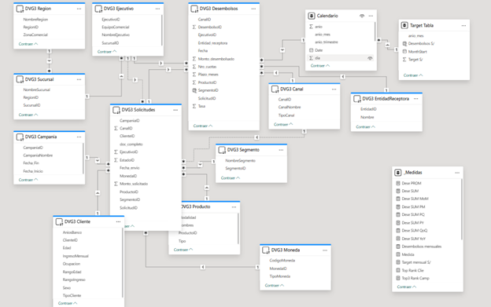


---

### 📊 B. Medidas Clave en el Modelo (DAX)

A continuación se documentan las principales medidas DAX creadas sobre el modelo.  
Todas ellas se definen en la tabla de medidas **`_Medidas`** dentro del modelo semántico.

#### 1️⃣ Medidas base de desembolsos
```dax

✅ Dese PROM – Monto promedio desembolsado

> Promedio del monto desembolsado en el contexto actual de filtro.

Dese PROM =
AVERAGE ( 'DVG3 Desembolsos'[Monto_desembolsado] )
```

```dax
✅ Dese SUM – Monto total desembolsado

Suma total del monto desembolsado en el periodo/contexto analizado.

Dese SUM =
SUM ( 'DVG3 Desembolsos'[Monto_desembolsado] )
```
2️⃣ Comparaciones temporales (MoM, QoQ, YoY)

```dax
✅ Dese SUM PM – Desembolsos del mes previo

Total desembolsado desplazado un mes hacia atrás usando la tabla Calendario.

Dese SUM PM =
CALCULATE (
    [Dese SUM],
    DATEADD ( Calendario[Date], -1, MONTH )
)
```
```dax
✅ Dese SUM PQ – Desembolsos del trimestre previo

Dese SUM PQ =
CALCULATE (
    [Dese SUM],
    DATEADD ( Calendario[Date], -1, QUARTER )
)
```
```dax
✅ Dese SUM PY – Desembolsos del año previo

Dese SUM PY =
CALCULATE (
    [Dese SUM],
    DATEADD ( Calendario[Date], -1, YEAR )
)

```
```dax
✅ Dese SUM MoM – Variación % Mes vs Mes Anterior

Crecimiento (o caída) porcentual de los desembolsos respecto al mes anterior.

Dese SUM MoM =
DIVIDE (
    [Dese SUM] - [Dese SUM PM],
    [Dese SUM PM]
)
```
```dax
✅ Dese SUM QoQ – Variación % Trimestre vs Trimestre Anterior

Dese SUM QoQ =
DIVIDE (
    [Dese SUM] - [Dese SUM PQ],
    [Dese SUM PQ]
)
```
```dax
✅ Dese SUM YoY – Variación % Año vs Año Anterior

Dese SUM YoY =
DIVIDE (
    [Dese SUM] - [Dese SUM PY],
    [Dese SUM PY]
)
```
3️⃣ Medidas de soporte al análisis temporal


```dax
✅ Desembolsos mensuales – Serie limpia por mes

Reconstruye la serie de desembolsos mes a mes usando las fechas de la tabla Calendario, garantizando alineamiento entre calendario y hechos.

Desembolsos mensuales =
VAR FechasMes =
    VALUES ( 'Calendario'[Date] )
RETURN
CALCULATE (
    SUM ( 'DVG3 Desembolsos'[Monto_desembolsado] ),
    TREATAS ( FechasMes, 'DVG3 Desembolsos'[Fecha] )
)
```
4️⃣ Metas y benchmark de negocio

🎯 Target mensual S/ – Meta mensual de desembolsos

Asigna una meta fija de desembolsos solo para el rango de fechas del proyecto (entre mayo 2025 y mayo 2027).
Fuera de ese rango, la medida devuelve BLANK().

```dax
Target mensual S/ =
VAR mIni =
    DATE (
        YEAR ( MIN ( 'Calendario'[Date] ) ),
        MONTH ( MIN ( 'Calendario'[Date] ) ),
        1
    )
RETURN
IF (
    NOT ISBLANK ( mIni )
        && mIni >= DATE ( 2025, 5, 1 )
        && mIni <= DATE ( 2027, 5, 1 ),
    129999546,
    BLANK ()
)
```
5️⃣ Rankings por cliente, campaña y canal

🥇 Top Rank Clie – Ranking de clientes por desembolsos

Calcula el ranking de clientes en función del promedio de desembolsos, respetando el contexto de filtros activo (segmento, región, campaña, etc.).


```dax
Top Rank Clie =
RANKX (
    ALLSELECTED ( 'DVG3 Cliente'[ClienteID] ),
    [Dese PROM],
    ,
    DESC,
    DENSE
)
```

🏆 Top3 Rank Camp – Ranking de campañas

Ranking de campañas según el promedio de desembolsos. Permite identificar las campañas más efectivas.


```dax
Top3 Rank Camp =
RANKX (
    ALLSELECTED ( 'DVG3 Campania'[CampaniaNombre] ),
    [Dese PROM],
    ,
    DESC,
    DENSE
)
```

📈 Top3 Rank Canal – Ranking de canales

Ranking de canales comerciales por desempeño en desembolsos.


```dax
Top3 Rank Canal =
RANKX (
    ALLSELECTED ( 'DVG3 Canal'[CanalNombre] ),
    [Dese PROM],
    ,
    DESC,
    DENSE
)
```
# 📊 Capa de Presentación (Power BI)

La Capa de Presentación integra todo el trabajo previo de modelado, transformación y aseguramiento de la calidad de datos, convirtiéndolo en una experiencia visual que permite analizar el rendimiento del BCP frente al sistema bancario peruano.

En esta sección se muestran las páginas principales del reporte en Power BI, organizadas para responder las tres preguntas clave del análisis de indicadores estratégicos:

WHAT? → ¿Cuál es el comportamiento actual del KPI?

SO WHAT? → ¿Qué implicancias tiene desviarse del objetivo?

NOW WHAT? → ¿Qué decisiones y acciones deben tomarse?

El reporte fue diseñado bajo un enfoque de claridad ejecutiva, priorizando:
✓ Mensajes directos
✓ Métricas clave
✓ Comparaciones relevantes
✓ Flujos de navegación simples (pestañas superiores)
✓ Uso de drill-through para profundizar en el análisis mensual

A continuación, se presentan las principales pantallas del reporte desarrollado en Power BI para el Banco de Crédito del Perú (BCP). Cada vista responde a una sección clave del análisis: desde la introducción al caso, pasando por la definición del indicador, hasta el análisis comercial y el reporte ejecutivo.


🖼️ 1. Portada del Proyecto


🖼️ 2. Planteamiento del Business Case
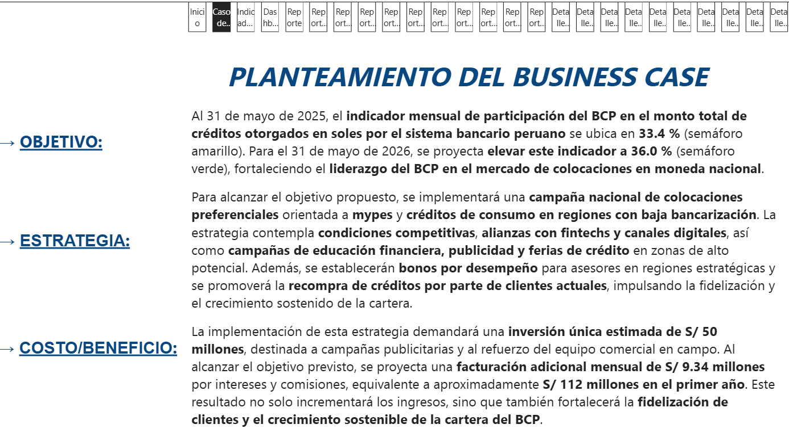

🖼️ 3. Indicador Mensual — Definición, Fórmula, Impacto y Rangos
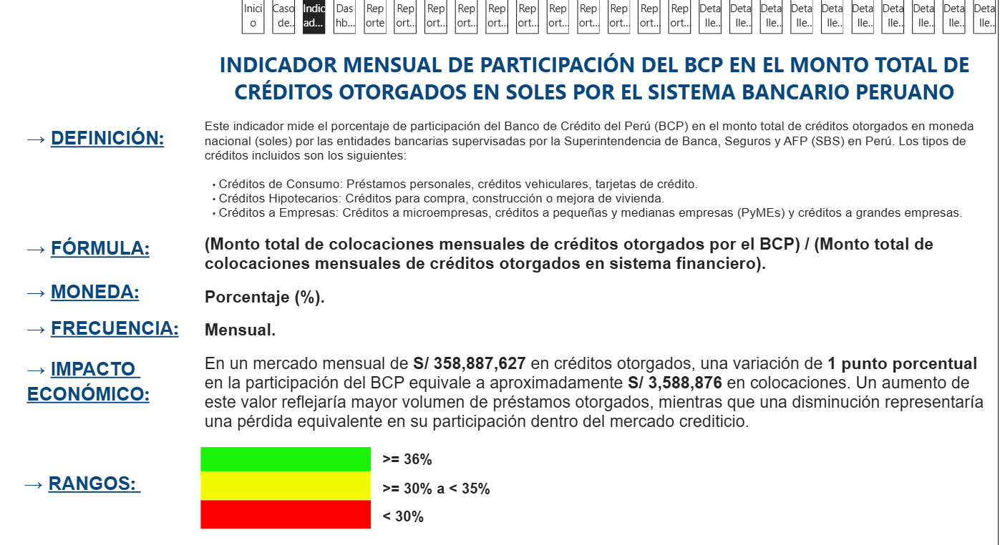

🖼️ 4. Dashboard Comercial del BCP
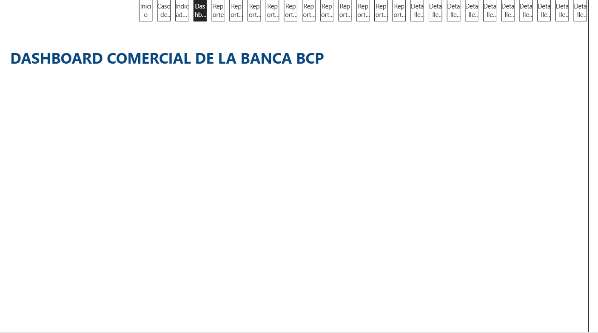

🖼️ 5. Reporte Ejecutivo — What / So What / Now What
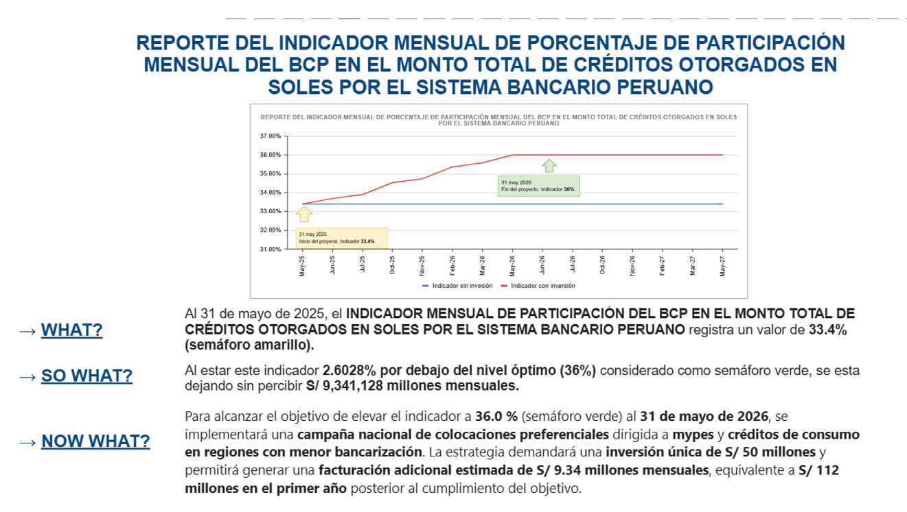

## 🔹 Preguntas del Reporte Analítico (Power BI)

A continuación se presentan las 10 preguntas del análisis junto con sus visualizaciones principales y sus vistas de detalle (Drill Through).
Cada pregunta sigue el mismo patrón:

a) Pregunta

b) Gráfico principal

c) Drill through (detalle)


1️⃣ Pregunta 1 — Canal
¿Cuáles son los tres tipos de canal que registraron el mayor aporte promedio en el INDICADOR MENSUAL DEL MONTO TOTAL DE CRÉDITOS OTORGADOS EN SOLES POR EL BCP durante el período comprendido entre mayo de 2025 y mayo de 2026?

Visualización principal:


Obtener detalles (Drill Through):
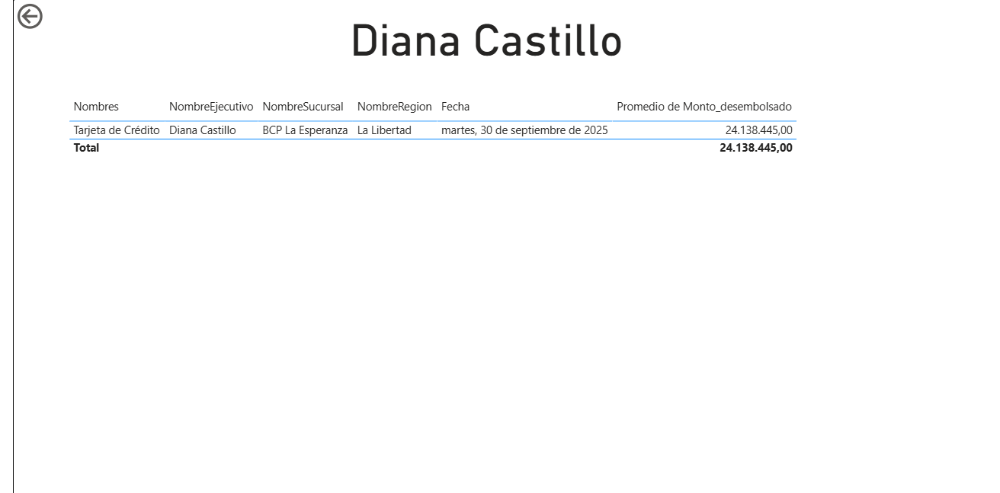


2️⃣ Pregunta 2 — Sucursales
¿Cuáles son las tres Sucursales que registraron el mayor aporte promedio en el INDICADOR MENSUAL DE PARTICIPACIÓN DEL BCP EN EL MONTO TOTAL DE CRÉDITOS OTORGADOS EN SOLES POR EL SISTEMA BANCARIO PERUANO durante el período comprendido entre mayo de 2025 y mayo de 2026?

Visualización principal:
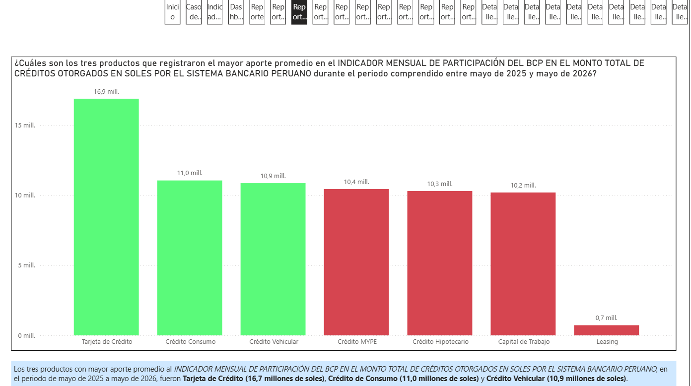


Obtener detalles (Drill Through):
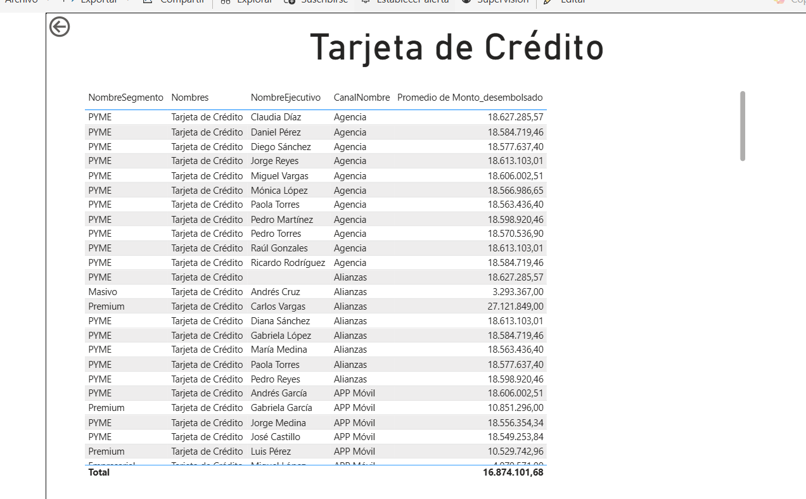

3️⃣ Pregunta 3 — Tipo de Producto
¿Qué TIPO DE PRODUCTO registró el mayor impacto en el valor promedio del INDICADOR MENSUAL DE PARTICIPACIÓN DEL BCP EN EL MONTO TOTAL DE CRÉDITOS OTORGADOS EN SOLES POR EL SISTEMA BANCARIO PERUANO durante el período mayo 2025 a mayo 2026?

Visualización principal:
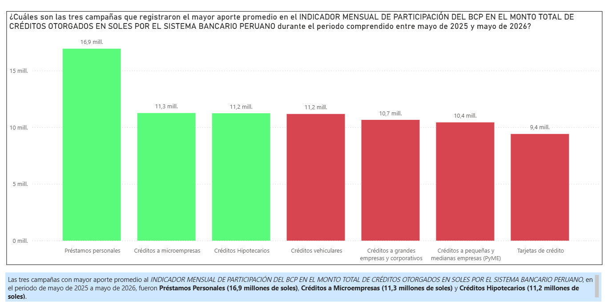


Obtener detalles (Drill Through):
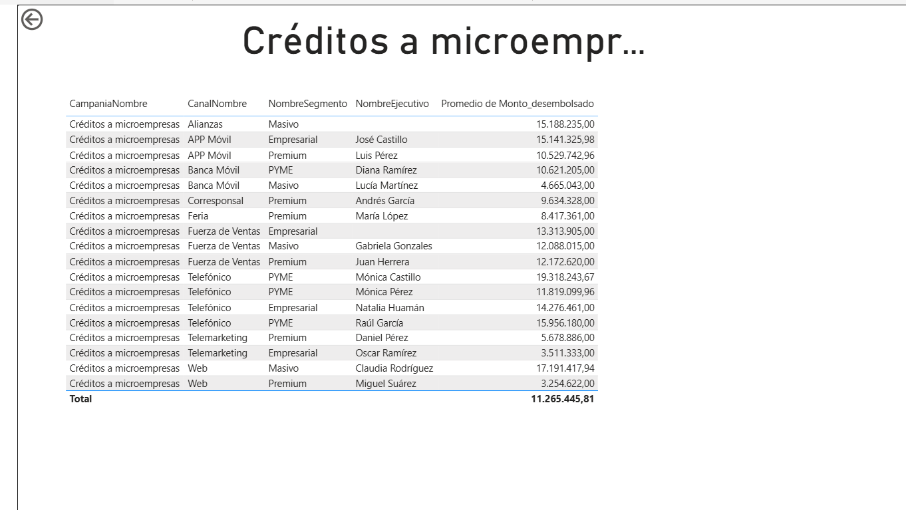


4️⃣ Pregunta 4 — Segmento
¿Cuál es el Top del segmento que registra el mayor aporte promedio en el INDICADOR MENSUAL DE PARTICIPACIÓN DEL BCP EN EL MONTO TOTAL DE CRÉDITOS OTORGADOS EN SOLES POR EL SISTEMA BANCARIO PERUANO durante el período comprendido entre mayo de 2025 y mayo de 2026?

Visualización principal:
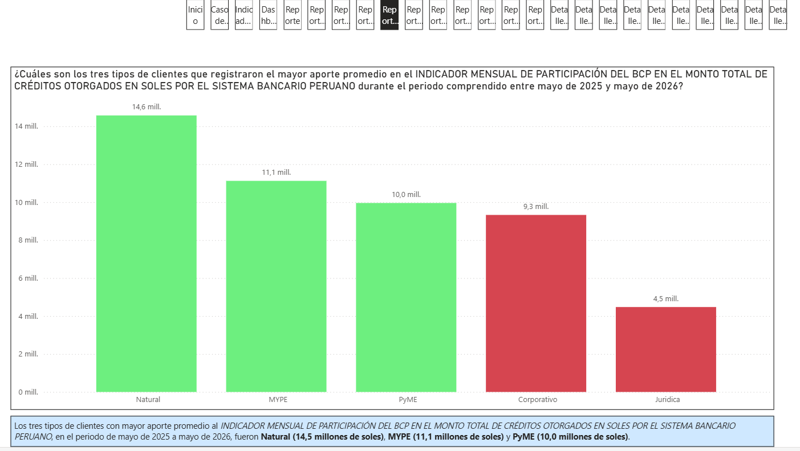


Obtener detalles (Drill Through):
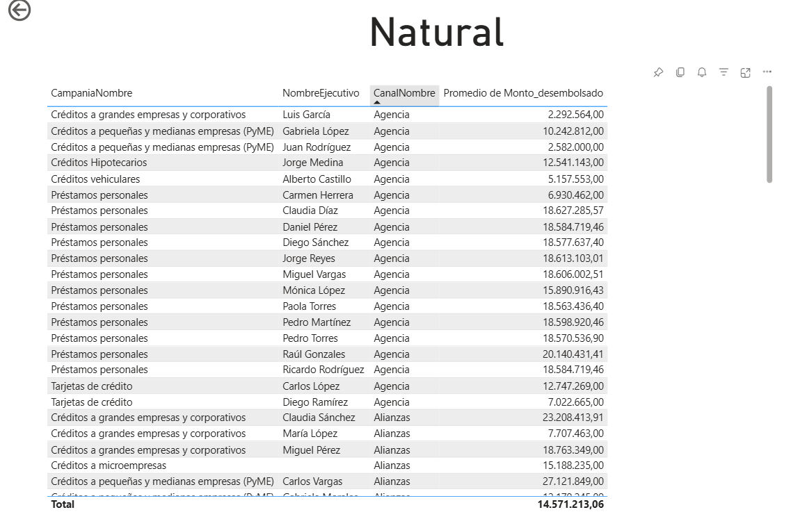


5️⃣ Pregunta 5 — Región
¿Cuáles son las tres regiones que registraron el mayor aporte promedio en el INDICADOR MENSUAL DE PARTICIPACIÓN DEL BCP EN EL MONTO TOTAL DE CRÉDITOS OTORGADOS EN SOLES POR EL SISTEMA BANCARIO PERUANO durante el período comprendido entre mayo de 2025 y mayo de 2026?

Visualización principal:
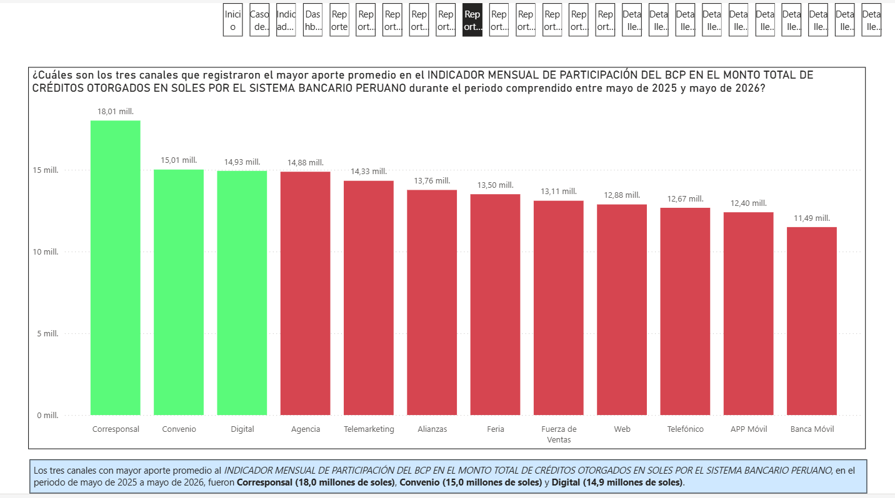

Obtener detalles (Drill Through):
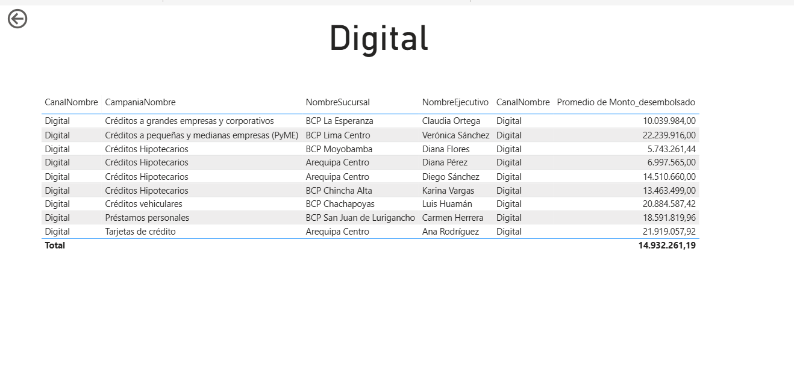


6️⃣ Pregunta 6 — Canales (Detalle Alterno)
¿Cuáles son los tres canales que registraron el mayor aporte promedio en el INDICADOR MENSUAL DE PARTICIPACIÓN DEL BCP EN EL MONTO TOTAL DE CRÉDITOS OTORGADOS EN SOLES POR EL SISTEMA BANCARIO PERUANO durante el período comprendido entre mayo de 2025 y mayo de 2026?

Visualización principal:
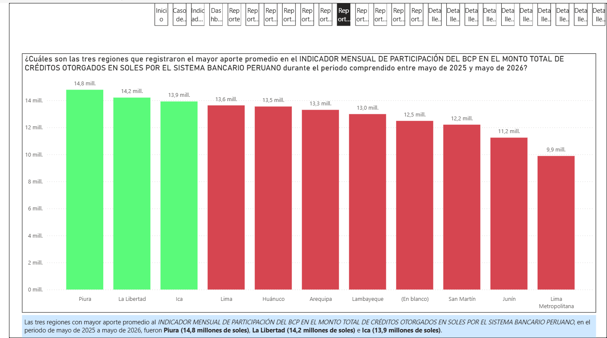

Obtener detalles (Drill Through):


7️⃣ Pregunta 7 — Tipos de Cliente
¿Cuáles son los tres tipos de clientes que registraron el mayor aporte promedio en el INDICADOR MENSUAL DE PARTICIPACIÓN DEL BCP EN EL MONTO TOTAL DE CRÉDITOS OTORGADOS EN SOLES POR EL SISTEMA BANCARIO PERUANO durante el período comprendido entre mayo de 2025 y mayo de 2026?

Visualización principal:
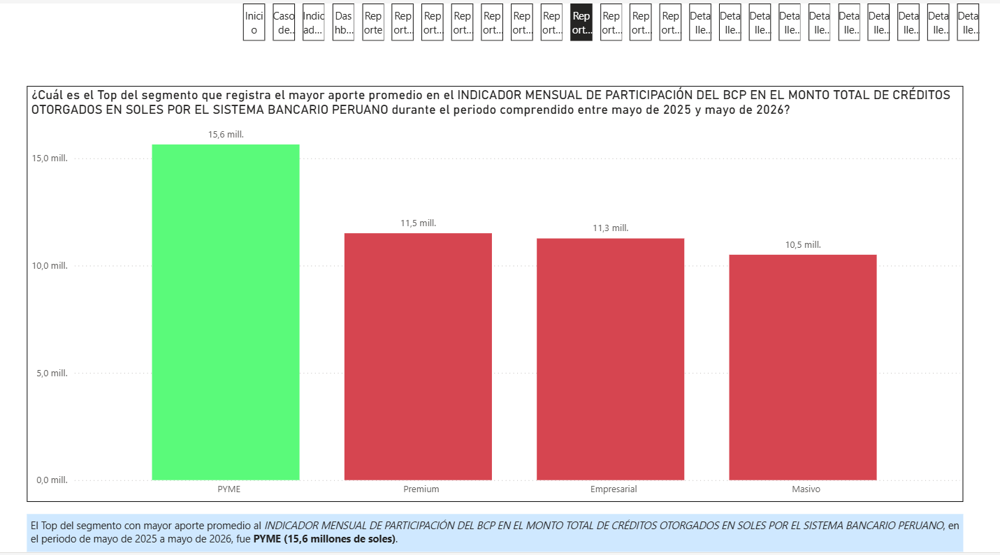


Obtener detalles (Drill Through):
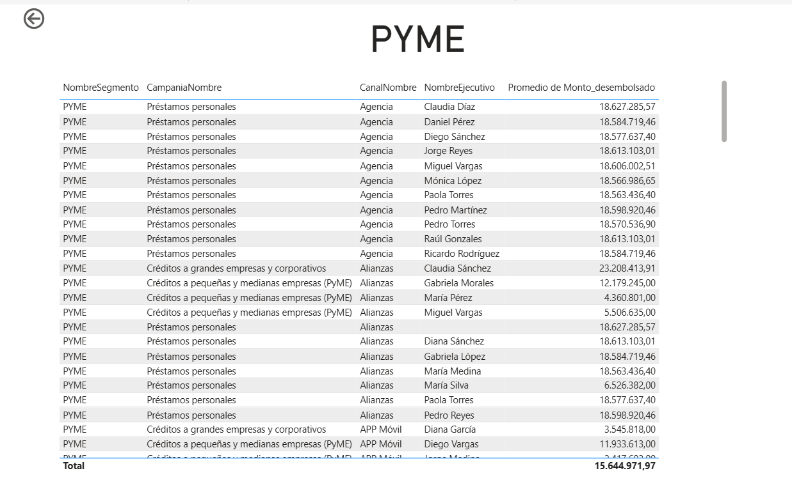


8️⃣ Pregunta 8 — Campañas
¿Cuáles son las tres campañas que registraron el mayor aporte promedio en el INDICADOR MENSUAL DE PARTICIPACIÓN DEL BCP EN EL MONTO TOTAL DE CRÉDITOS OTORGADOS EN SOLES POR EL SISTEMA BANCARIO PERUANO durante el período comprendido entre mayo de 2025 y mayo de 2026?

Visualización principal:
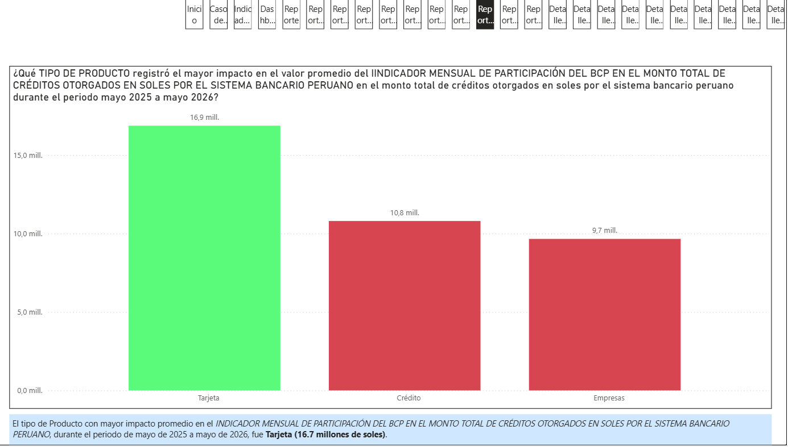


Obtener detalles (Drill Through):
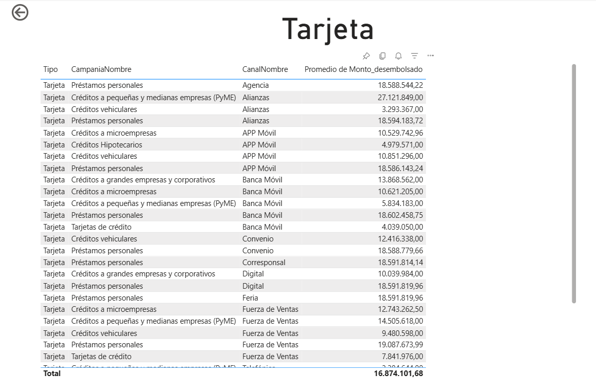


9️⃣ Pregunta 9 — Productos (Detalle Alterno)
¿Cuáles son los tres productos que registraron el mayor aporte promedio en el INDICADOR MENSUAL DE PARTICIPACIÓN DEL BCP EN EL MONTO TOTAL DE CRÉDITOS OTORGADOS EN SOLES POR EL SISTEMA BANCARIO PERUANO durante el período comprendido entre mayo de 2025 y mayo de 2026?

Visualización principal:
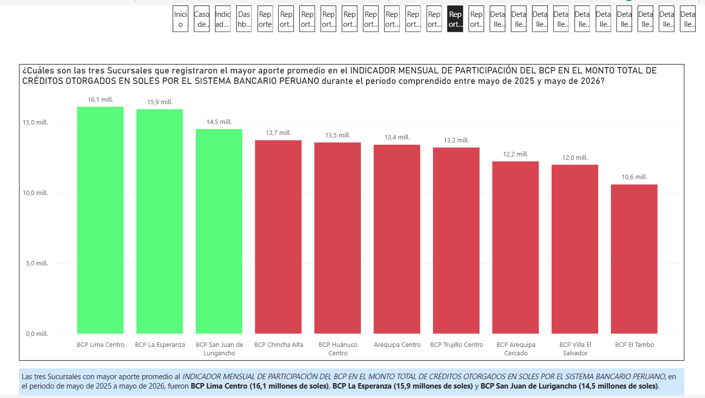


Obtener detalles (Drill Through):
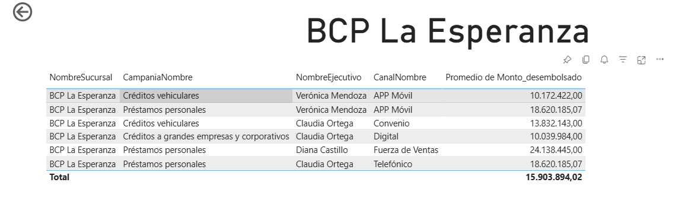


🔟 Pregunta 10 — Ejecutivos
¿Quiénes conforman el Top 3 de EJECUTIVOS que tuvieron el mayor aporte promedio en el valor del INDICADOR MENSUAL DE PARTICIPACIÓN DEL BCP EN EL MONTO TOTAL DE CRÉDITOS OTORGADOS EN SOLES POR EL SISTEMA BANCARIO PERUANO durante el período de mayo 2025 a mayo 2026?

Visualización principal:
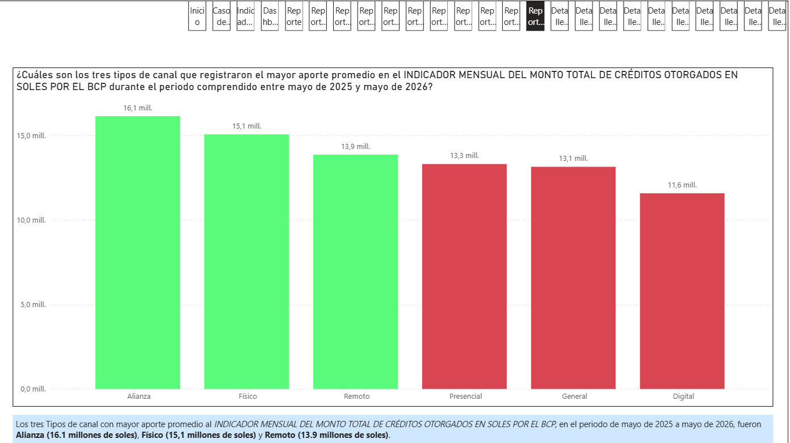


Obtener detalles (Drill Through):
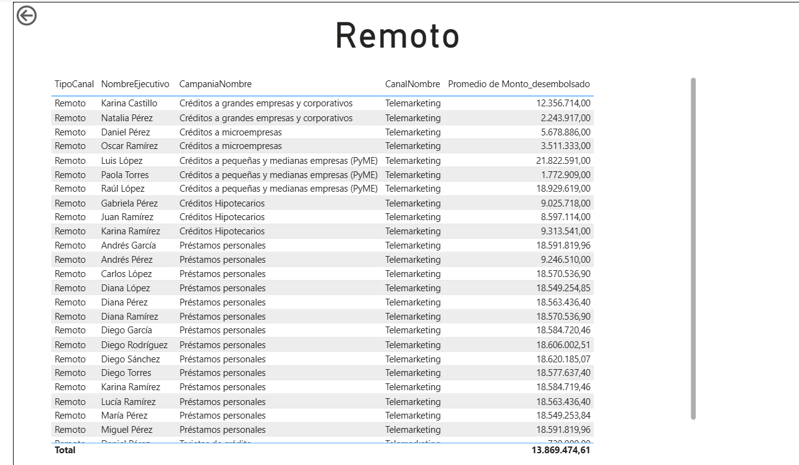


<section style="padding: 60px 0; text-align: center;">
  <h2 style="font-size: 42px; font-weight: 700; margin-bottom: 10px;">Stack Tecnológico</h2>
  <div style="width: 80px; height: 4px; background:#c27b3a; margin: 0 auto 40px auto; border-radius: 2px;"></div>

  <div style="display: grid; grid-template-columns: repeat(auto-fit, minmax(260px, 1fr)); gap: 25px; width: 90%; margin: auto;">
    
    <!-- Tarjeta 1 -->
    <div style="background: #ffffff; padding: 30px; border-radius: 18px; 
                box-shadow: 0 8px 20px rgba(0,0,0,0.07); transition: 0.25s; cursor: pointer;"
         onmouseover="this.style.transform='scale(1.04)'"
         onmouseout="this.style.transform='scale(1)'">
      
      <h3 style="font-size:20px; margin-top: 10px;">Microsoft Fabric</h3>
      <p style="color:#555; font-size: 15px;">Ingesta, transformación y orquestación del flujo de datos.</p>
    </div>

    <!-- Tarjeta 2 -->
    <div style="background: #ffffff; padding: 30px; border-radius: 18px; 
                box-shadow: 0 8px 20px rgba(0,0,0,0.07); transition: 0.25s; cursor: pointer;"
         onmouseover="this.style.transform='scale(1.04)'"
         onmouseout="this.style.transform='scale(1)'">
      
      <h3 style="font-size:20px; margin-top: 10px;">Python</h3>
      <p style="color:#555; font-size: 15px;">Automatizaciones, validaciones y cálculos ETL.</p>
    </div>

    <!-- Tarjeta 3 -->
    <div style="background: #ffffff; padding: 30px; border-radius: 18px; 
                box-shadow: 0 8px 20px rgba(0,0,0,0.07); transition: 0.25s; cursor: pointer;"
         onmouseover="this.style.transform='scale(1.04)'"
         onmouseout="this.style.transform='scale(1)'">
      
      <h3 style="font-size:20px; margin-top: 10px;">SQL Warehouse</h3>
      <p style="color:#555; font-size: 15px;">Almacenamiento estructurado y consultas de alto rendimiento.</p>
    </div>

    <!-- Tarjeta 4 -->
    <div style="background: #ffffff; padding: 30px; border-radius: 18px; 
                box-shadow: 0 8px 20px rgba(0,0,0,0.07); transition: 0.25s; cursor: pointer;"
         onmouseover="this.style.transform='scale(1.04)'"
         onmouseout="this.style.transform='scale(1)'">
      
      <h3 style="font-size:20px; margin-top: 10px;">Power BI</h3>
      <p style="color:#555; font-size: 15px;">Dashboard estratégico e insights interactivos.</p>
    </div>

    <!-- Tarjeta 5 -->
    <div style="background: #ffffff; padding: 30px; border-radius: 18px; 
                box-shadow: 0 8px 20px rgba(0,0,0,0.07); transition: 0.25s; cursor: pointer;"
         onmouseover="this.style.transform='scale(1.04)'"
         onmouseout="this.style.transform='scale(1)'">
      
      <h3 style="font-size:20px; margin-top: 10px;">DAX</h3>
      <p style="color:#555; font-size: 15px;">Cálculo de KPIs avanzados y lógica de negocio.</p>
    </div>

    <!-- Tarjeta 6 -->
    <div style="background: #ffffff; padding: 30px; border-radius: 18px; 
                box-shadow: 0 8px 20px rgba(0,0,0,0.07); transition: 0.25s; cursor: pointer;"
         onmouseover="this.style.transform='scale(1.04)'"
         onmouseout="this.style.transform='scale(1)'">
      
      <h3 style="font-size:20px; margin-top: 10px;">Data Warehouse</h3>
      <p style="color:#555; font-size: 15px;">Modelo dimensional optimizado para análisis del KPI.</p>
    </div>

  </div>
</section>


